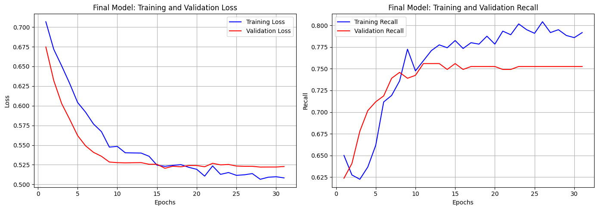
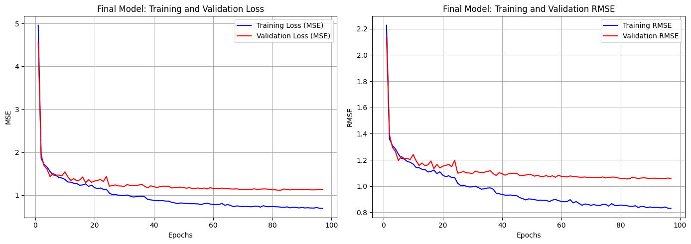

# Neural Network Playground

_Personal playground for prototyping neural networks on tabular data — comparing deep learning against XGBoost/LightGBM & Traditional Machine Learning Models on real classification & regression problems._

## Table of Contents

- [Neural Network Playground](#neural-network-playground)
  - [Table of Contents](#table-of-contents)
  - [Overview](#overview)
  - [Projects](#projects)
  - [Outputs](#outputs)
    - [Customer Churn ANN](#customer-churn-ann)
    - [Car Price Prediction](#car-price-prediction)
  - [Tech Stack](#tech-stack)
  - [Installation](#installation)
    - [Install Python](#install-python)
    - [Clone the repository](#clone-the-repository)
    - [Install Dependencies](#install-dependencies)
    - [Optional: Add GPU Support](#optional-add-gpu-support)
      - [Verify GPU Support](#verify-gpu-support)
  - [Core Focus Areas](#core-focus-areas)
  - [Roadmap](#roadmap)
  - [License](#license)

## Overview

A growing collection of neural network experiments focused on solving real-world regression and classification problems using modern deep learning frameworks.

This repository serves as my experimentation space — a place to prototype architectures, compare models, analyze performance, and continuously refine my understanding of neural networks on structured datasets.


## Projects

| Project              | Type                  | Project File                               | Dataset                                  |
| -------------------- | --------------------- | ------------------------------------------ | ---------------------------------------- |
| Car Price Prediction | Regression            | [File](car_price.ipynb)                    | [data](dataset/car_price_prediction.csv) |
| Loan Approval        | Binary Classification | [File](loan_approval_classification.ipynb) | [data](dataset/loan_data.csv)            |
| Customer Churn       | Binary Classification | [File](customer_churn.ipynb)               | [data](dataset/churn.csv)                |

## Outputs

### Customer Churn ANN



### Car Price Prediction



## Tech Stack

- Python 3.12
- Data Analysis
  - Pandas & NumPy
  - Matplotlib & Seaborn
- Machine Learning & Preprocessing
  - Scikit-learn
- Boosting
  - XGBoost
  - LightGBM
- Deep Learning
  - Keras (Torch backend)
  - PyTorch

## Installation

### Install Python

All projects were developed using **Python 3.12.0**.  
Download it from: [Here](https://www.python.org/downloads/release/python-3120/)

### Clone the repository

```bash
git clone https://github.com/KavyaJP/Neural-Networks.git
cd Neural-Networks
```

### Install Dependencies

Install the required dependencies:

```bash
pip install -r requirements.txt
```

But you might want to make a venv if you are on Linux:

```bash
python3 -m venv venv
source venv/bin/activate
pip install -r requirements.txt
```

### Optional: Add GPU Support

1. Go to [PyTorch - Get Started](https://pytorch.org/get-started/locally/)
2. Select
   - OS
   - Package: pip
   - Language: Python
   - Compute Platform:
     - CUDA (For NVidia GPU)
     - ROCm (For AMD GPU - only works on Linux, try using WSL for support on Windows)
3. Run the installation command provided on the website.

#### Verify GPU Support

After installing the CUDA-enabled version of PyTorch, run:

```bash
python check_gpu.py
```

If everything is configured correctly, it should detect your GPU.

## Core Focus Areas

- Designing and training feedforward neural networks
- Comparing deep learning with traditional ML and boosting models
- Building structured preprocessing pipelines
- Evaluating model performance with proper metrics
- Experimenting with GPU-accelerated training

## Roadmap

- Multi-class classification problems
- Deeper and regularized architectures
- Hyperparameter tuning workflows
- Tabular deep learning vs boosting vs traditional ML benchmarks

## License

This repository is licensed under [MIT License](LICENSE), i.e. you are free to do anything with the available code.
